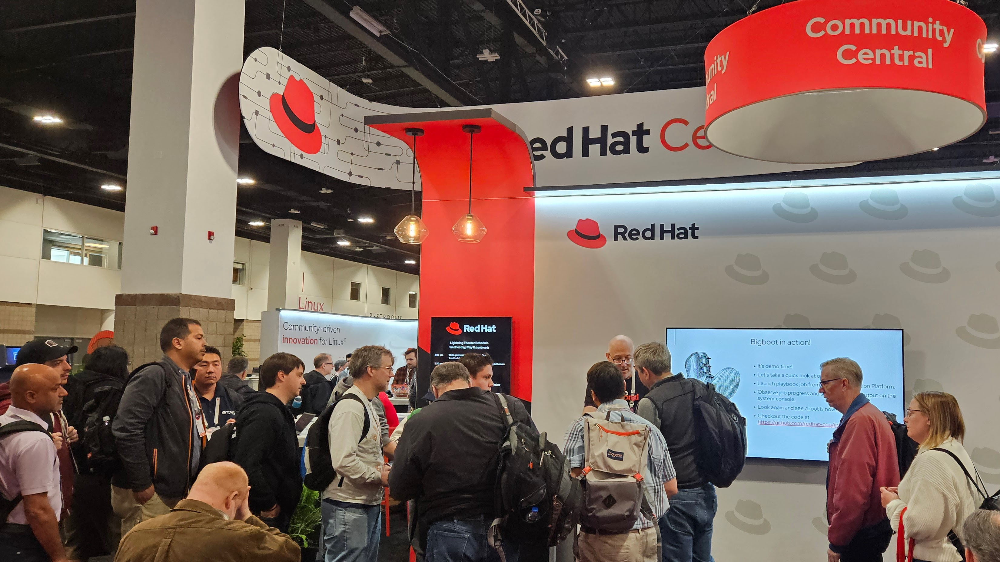
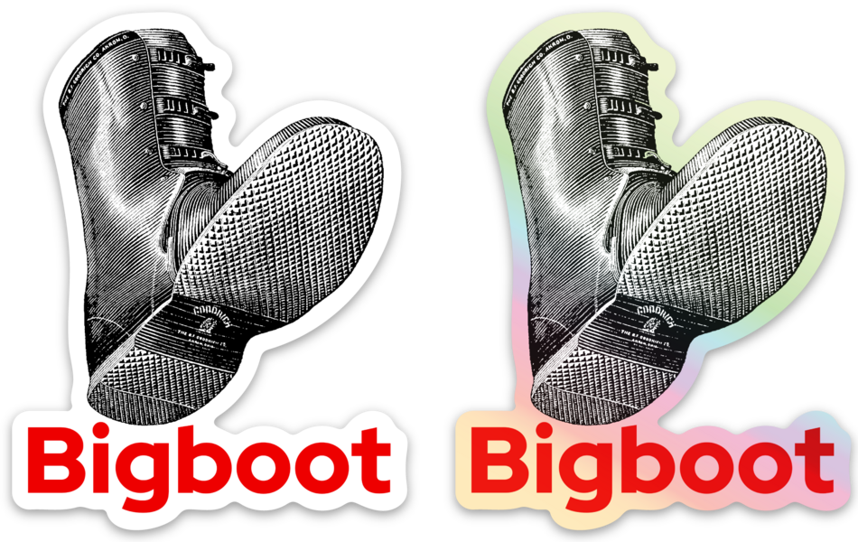

# Bigboot Stickers

I presented a lightning talk at Red Hat Summit 2024 giving an overview and demo of the [`bigboot`](./roles/bigboot/) role. To help drive engagement and add some excitement, I had 100 of these stickers printed up. The talk was well received and all the stickers were given away.

Since then, lots of folks asked me if there are more stickers. Well, I recently discovered how to make them available for folks to order at Sticker Mule. You can get 10 stickers for 9.99 USD. These are nice die cut stickers measuring 2.29" x 3" (58mm x 76mm). They are available with [plain white vinyl](https://www.stickermule.com/swapdisk/item/14744765) the same as the ones I gave away or with this [fancy pants holigraphic background](https://www.stickermule.com/swapdisk/item/17024469) that looks really cool.

If you have the means to print your own stickers or just want the source artwork, download the 1200 dpi image file [here](images/bigboot-sticker-transbg-1200dpi.png).

Add some bling to your laptop lid today and share with your friends. Cheers!
